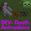

# Death Animations v2.0 Test Branch

> A data pack for 1.14x-1.19x

## Features

Mobs have new, epic animations when they die.

**Works with:**
Zombies, Husks, Skeletons, Strays, Creepers, Drowned, Phantoms, Villagers, Pillagers, Evokers, Vindicators, Pigs, Cows, Chickens, Sheep, Iron golems, Ravagers, Endermites.

Most body parts can be picked up with a right-click.
You can also use them in workbenches or even eat them.

Unique animations are available for Iron Golems, Phantoms, Endermites and Ravagers.

Make sure to adjust the data pack for your needs by opening the settings (`/trigger settings`)

## Installation

Download the latest release from [here](https://github.com/Tschipcraft/deathanimations/releases/latest) and put the datapack zip file into the `datapacks` folder of your Minecraft world.

## Updates

To check for updates use `/trigger menu` and hit the Check for Updates button. There is also a **Reset** and an **Uninstall** button.
